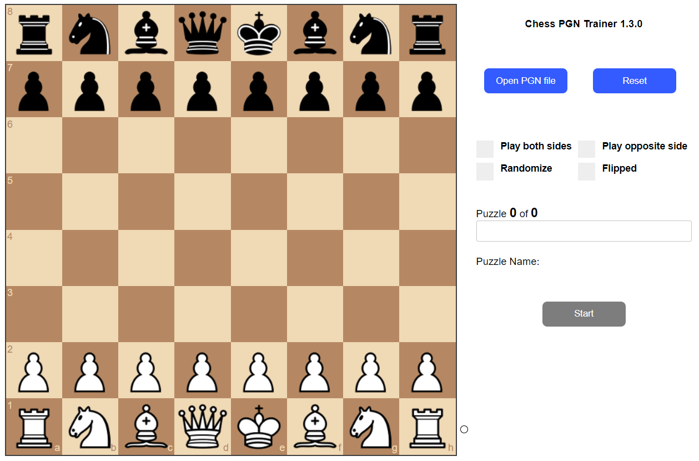
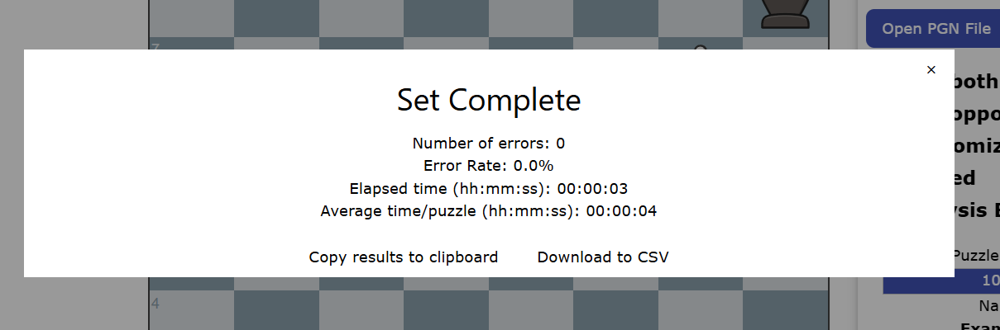

# Chess-PGN-Trainer
Online tool that opens chess PGN files and allows the user to practice the moves.

[Live demo available here](https://rodpolako.github.io/)



This basic tool is to help with drilling a set group of puzzles but with any appropriately configured PGN file.  

PGN Files need only three parts:
* FEN - The representation of the board and associated information
* The moves for both white and black.
* (Optional) the "Event" tag so that the puzzle has a label

Here is an example PGN created using the analysis board from chess.com with a really basic endgame that was just saved to a file.
```
[Event "Example 1"]
[Site "?"]
[Date "????.??.??"]
[Round "?"]
[White "?"]
[Black "?"]
[Result "1-0"]
[SetUp "1"]
[FEN "7k/8/8/3Q1K2/8/8/8/8 w - - 0 1"]

1. Kf6 Kh7 2. Qf7+ Kh8 3. Qg7# 1-0
```
Use the "Open PGN file" button to open this file and you can practice this puzzle.  


The PGN file can have any number of puzzles so you can work through a set in one shot.

This tool has a couple of other features that you might like:
* Auto move to next puzzle - Automatically advances to the next puzzle upon completion of the current one
* Play both sides - Allows the player to play both sides of the puzzle
* Randomize - Presents the puzzles in the set in a random order
* Flipped - Allows you to play the puzzle from the other side of the board.  May help to develop sense when a given tactic is being used on you.
* Play Opposite Side - Allows the player to go second instead and makes the computer play the first move from the PGN.  Useful for when you want to practice opening defenses instead of puzzles.  For example, if you wanted to practice a defense as black, load a PGN with the move order you want to practice and this feature will play as white and play the moves in the PGN while you play the response.  Recommended that you use the Flipped option in conjunction with this one.
* Analysis Board - Generates a link to a Lichess analysis board of the currently displayed puzzle
* Pause - Useful if you are doing a large number of puzzles and need to step away.  Click on the pause button and the board will clear and the timer will stop.  Click Resume in order to continue.  Your elapsed time will not include the paused time.
* Hints - You can hold down the **spacebar** at any time during a puzzle to see the next expected move.  Just know that if a hint is used, it will be counted as an error in your performance.
* Restart/replay - You can repeat the current puzzleset upon completion with a single click. Useful if you want to try again with the same settings.  When the current set is complete, just click on "Restart" to try the current PGN file again.  If you want, you can choose different settings like random, flipped, etc. before restarting.
* Feature settings via PGN Tags - You can configure a PGN to set a default combination of features by adding the relevant tag to the first puzzle in the PGN.  Details below.
  
Once a test group is completed, tool displays the following performance information:
* Number of errors
* Time to completion
* Average time per puzzle (Calculated)
* Error rate (Calculated)

## Default settings via PGN Tags
You can set the default options via custom tags in the PGN.  For example, if you have a set of puzzles that you always want to be in random order, you can add a tag to the first puzzle in the PGN and it will automatically check the Randomize box when the file is loaded.
Here is the example PGN with the randomize setting turned on.
```
[Event "Example 1"]
[Site "?"]
[Date "????.??.??"]
[Round "?"]
[White "?"]
[Black "?"]
[Result "1-0"]
[SetUp "1"]
[FEN "7k/8/8/3Q1K2/8/8/8/8 w - - 0 1"]
[PGNTrainerRandomize "1"]

1. Kf6 Kh7 2. Qf7+ Kh8 3. Qg7# 1-0
```
Or another use case could be that you want to practice defenses as black and you have a PGN that has the move sequences you want to practice.  Ideally you would want to use the flipped and play opposite side options every time so that you see the board from black's perspective and the computer makes the opening move.  You can set that with the ```[PGNTrainerFlipped "1"]``` and ```[PGNTrainerOppositeSide "1"]``` tags in the PGN and every time you load that PGN going forward, those options will automatically be selected.  You can always de-select a setting if you want something different for a particular run.

The available tags are:
* ```[PGNTrainerBothSides "1"]``` - This will check the "Play both sides" option
* ```[PGNTrainerOppositeSide "1"]``` - This will check the "Play opposite side" option
* ```[PGNTrainerRandomize "1"]``` - This will check the "Randomize" option
* ```[PGNTrainerFlipped "1"]``` - This will check the "Flipped" option
* ```[PGNTrainerAnalysisLink "1"]``` - Useful when you want to analyze a specific puzzle during a run in order to analyze or troubleshoot.  This will place the a link below the title of the puzzle which will open an analysis board in Lichess with the position (in a new tab/window).

The value of the tag has to be 1 in order to activate.  Any other value or omission of the tag entirely will be ignored.

You can use any combination of the above tags.  Just insert the desired tag in the first puzzle.

## Known limitations
* The PGN parser ignores variations in a PGN file.  Attempting to use a PGN with these will not work and will only play the "main-line".  If you want to work a line that has variations, break out each variation into its own entry in the PGN.
For example, the following PGN shows a position where the black king has two possible moves recorded after Qe5+:
```
[Event "?"]
[FEN "r1r1k3/5p2/3K4/2Q5/8/8/8/8 w - - 1 1"]

1. Qe5+ Kf8 (1... Kd8 2. Qe7#) 2. Qh8# 1-0
```
Loading this PGN as-is will result in the tool indicating that there is only 1 puzzle, the main line. To get the tool to test the main line and the variation, copy the entry and show each variation separately.  Like this:

```
[Event "?"]
[FEN "r1r1k3/5p2/3K4/2Q5/8/8/8/8 w - - 1 1"]

1. Qe5+ Kf8 2. Qh8# 1-0

[Event "?"]
[FEN "r1r1k3/5p2/3K4/2Q5/8/8/8/8 w - - 1 1"]

1. Qe5+ Kd8 2. Qe7#
```
In this way, the tool will see that there are two puzzles and test both.

## Setup Instructions
1. Download & extract the zip into a folder and start a web server from there.
2. In a browser, point to index.html.

## Usage
1. Click on "Open PGN File"
2. Navigate to the desired PGN file and then click on OK
3. Place a checkmark next to any desired features (such as random, flipped, play both sides)
4. When ready, click on start and the first puzzle in the set will be displayed and you can make your first move.
5. When the puzzle is finished, the next puzzle in the set will be automatically loaded
6. When the set of puzzles is complete, your final stats will be displayed.
7. You can pause any time if you need to step away.
8. If you get stuck you can get a hint by holding down the **spacebar**

You can then start a new PGN file by repeating these steps.

## References
Built with the help of the following projects:
* [chess.js](https://github.com/jhlywa/chess.js) chess.js is a TypeScript chess library used for chess move generation/validation, piece placement/movement, and check/checkmate/stalemate detection - basically everything but the AI.
* [pgn-parser](https://github.com/mliebelt/pgn-parser): Javascript library to allow reading of a PGN (Portable Game Notation) chess game notation, and providing the result as JSON.
* [chessboardjs](https://github.com/oakmac/chessboardjs/) chessboard.js is a standalone JavaScript Chess Board. It is designed to be "just a board" and expose a powerful API so that it can be used in different ways.
* [pawn-promotion](https://github.com/siansell/pawn-promotion) Quick and dirty example showing one approach to pawn promotion with chessboard.js and chess.js.
* [lichess-org/lila](https://github.com/lichess-org/lila/tree/master) Lila (li[chess in sca]la) is a free online chess game server focused on realtime gameplay and ease of use.


## Possible ideas for improvements/features
* Enhance the PGN-Parser to also read variations and load each variation as another puzzle.
* While the site does work on mobile, it is not optimized for that format.  A UI overhaul with a responsive design would be nice.
* Add an option to auto-save the results to a hosted file.  Maybe something like adding a row to a google sheet?
* What would be really nice is if there was a way to organize all the PGNs I want to test as part of a larger structure so that I would be able to choose from a defined list which includes the info on the PGN file to use along with the desired settings.  Not immediately sure how this would work due to security restrictions on the browser preventing direct access to local files.
